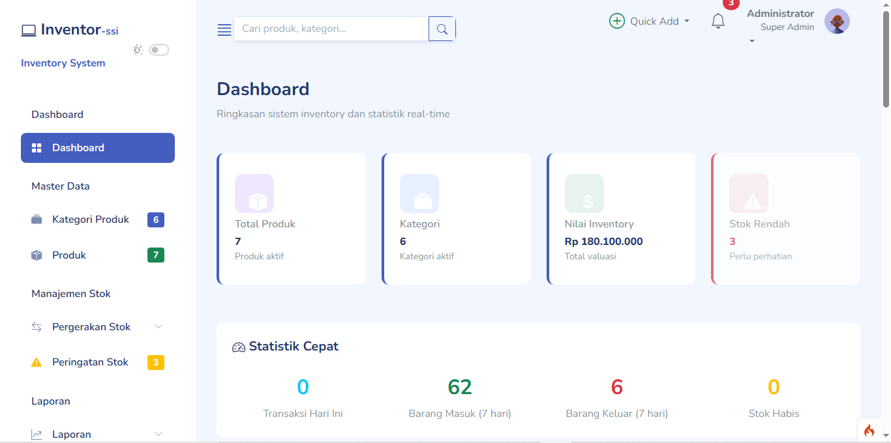
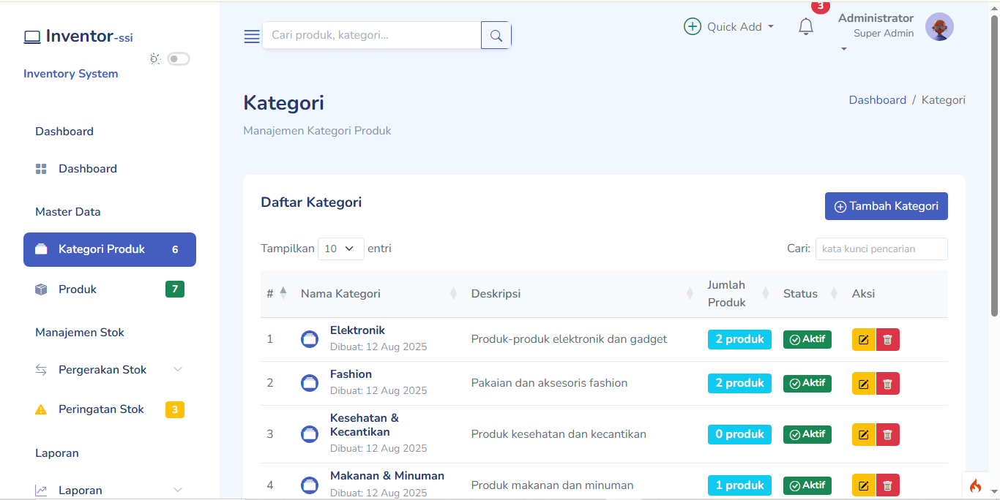

# 📦 SIMATK - Sistem Informasi Manajemen Alat Tulis Kantor



**SIMATK** adalah sebuah aplikasi web berbasis **CodeIgniter 4** yang dirancang secara khusus untuk mempermudah manajemen inventaris Alat Tulis Kantor (ATK) dalam sebuah instansi/fakultas. Sistem ini melacak secara real-time pergerakan masuk-keluarnya barang, memproses alur permintaan dari peminjam, dan menyediakan laporan rekapitulasi yang komprehensif.

---

## 🚀 Fitur Utama

### 1. 📊 Dashboard Interaktif
Menyediakan ringkasan total barang, peringatan stok rendah/habis, *quick actions* berdasarkan hak akses, serta visualisasi grafik pergerakan stok bulanan menggunakan **Chart.js**.

### 2. 🗃️ Manajemen Master Data
- **Kategori & Kode Barang**: Pengklasifikasian ATK secara terstruktur.
- **Barang (Products)**: Manajemen pendataan ATK dengan fitur penentuan batas stok minimum (untuk men-trigger notifikasi stok menipis).

### 3. 📦 Manajemen Stok (In/Out & Opname)
- **Barang Masuk**: Mencatat penambahan stok baru ke dalam gudang inventaris.
- **Barang Keluar**: Mengeluarkan stok secara manual.
- **Penyesuaian (Stock Opname)**: Melakukan sinkronisasi antara stok fisik dan kalkulasi sistem.
- **Riwayat Stok**: Melacak seluruh pergerakan barang secara detail (mutasi stok masuk, keluar, dan distribusi).

### 4. 📝 Sistem Permintaan (Request Workflow)
- **Form Permintaan Publik (`/ask`)**: Staf/Pengguna dapat meminta ATK tanpa harus *login*. Cukup mengisi form biodata peminjam dan memilih barang (bahkan dapat me-request barang baru di luar sistem dengan opsi "Barang Lainnya").
- **Kode Resi Track**: Sistem melacak permintaan menggunakan **Kode Resi** unik, sehingga staf dapat mengecek status permintaan secara mandiri.
- **Persetujuan Admin**: Admin meninjau permintaan dan dapat memberikan **Persetujuan (Approve)**, **Membatalkan (Cancel)**, atau **Mendistribusikan** (langsung memotong stok sistem).

### 5. 👥 Manajemen Pengguna & Multi-Role
Sistem keamanan berbasis *Role-Based Access Control* (RBAC):
- **Superadmin**: Memiliki akses ke manajemen pengguna, pengubahan hak akses, serta pengaturan *Appearance* antarmuka halaman publik (Logo, Instansi, Banner).
- **Admin**: Bertugas mengelola master data ATK, operasional stok gudang harian, dan melayani persetujuan permintaan ATK.

### 6. 📈 Pelaporan & Ekspor (Reporting)
- Laporan Stok Saat Ini.
- Laporan Pergerakan Barang (Mutasi).
- Ekspor grafik dan cetak log aktivitas yang siap digunakan sebagai dokumen pertanggungjawaban.

---

## 🛠️ Tech Stack

Sistem SIMATK dibangun dengan pendekatan **MVC (Model-View-Controller)** menggunakan teknologi mutakhir:

### Backend
- **PHP 8.2+**
- **CodeIgniter 4** (Web Framework utama)
- **MySQL / MariaDB** (Database Relasional)

### Frontend
- **HTML5 & CSS3** (Custom UI / `simatk-theme.css`)
- **JavaScript Biasa** (Modular, Non-jQuery dependent design pattern)
- **Bootstrap 5** (CSS Framework & Responsiveness)
- **Bootstrap Icons** (Tipografi icon)

### Library & Plugins Eksternal
- **Chart.js**: Rendering grafik interaktif di Dashboard dan Laporan.
- **SweetAlert2**: Notifikasi dialog konfirmasi yang modern.
- **DataTables**: Fitur tabel data *client-side* yang interaktif (Search, Sort, Pagination).

---

## 📸 Cuplikan Layar (Screenshots)

### 1. Tampilan Dashboard Utama


### 2. Manajemen Kategori & Tampilan Tabel


---

## ⚙️ Persyaratan Sistem (Server Requirements)

- PHP `^8.2`
- Database MySQL atau MariaDB
- Ekstensi PHP diaktifkan: `intl`, `mbstring`, `json`, `mysqlnd`, `curl`
- Composer 

## 🏗️ Cara Instalasi (Setup)

1. **Clone repositori**
   ```bash
   git clone https://github.com/xtrayou/SIMATK.git
   cd simatk
   ```

2. **Instal Dependensi**
   ```bash
   composer install
   ```

3. **Konfigurasi Environment**
   Salin file `env` menjadi `.env`. Buka file `.env` lalu sesuaikan konfigurasi *Database* dan *Base URL*:
   ```env
   CI_ENVIRONMENT = development
   app.baseURL = 'http://localhost:8080/'

   database.default.hostname = localhost
   database.default.database = nama_db_simatk
   database.default.username = root
   database.default.password = 
   database.default.DBDriver = MySQLi
   ```

4. **Jalankan Migrasi & Seeder Database**
   ```bash
   php spark migrate
   php spark db:seed ProdukExcelSeeder
   ```

5. **Jalankan Server Lokal**
   ```bash
   php spark serve
   ```
   Buka web browser dan akses aplikasi melalui `http://localhost:8080/`.

---
*Dikembangkan oleh @xtrayou sebagai tugas akhir/skripsi.*
